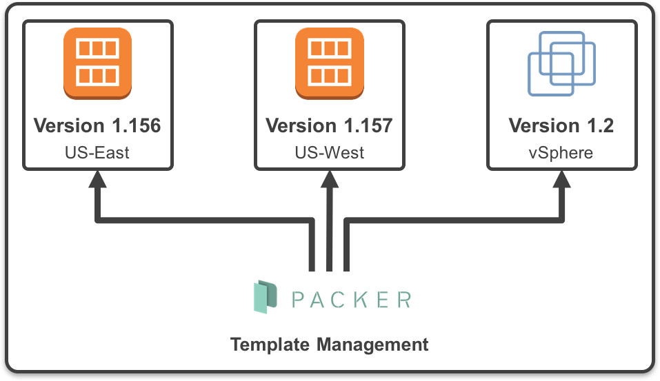

# AMI with Packer

## Installing Packer on Linux (Controller)
- `curl -fsSL https://apt.releases.hashicorp.com/gpg | sudo apt-key add -`
- `sudo apt-add-repository "deb [arch=amd64] https://apt.releases.hashicorp.com $(lsb_release -cs) main"`
- `sudo apt-get update && sudo apt-get install packer`
- `packer --version` to check if installed

Copy AMI:
- `sudo nano copy_ami.pkr.hcl`
```JSON
{
  "variables": {
    "instance_size": "t2.micro",
    "ami_name": "eng89_ron_ami_packer",
    "base_ami": "ami-03360601231433d7a",
    "ssh_username": "ubuntu",
    "vpc_id": "vpc-07e47e9d90d2076da",
    "subnet_id": "subnet-0429d69d55dfad9d2"
  },
  "builders": [
  {
    "type": "amazon-ebs",
    "region": "eu-west-1",
    "source_ami": "{{user `base_ami`}}",
    "instance_type": "{{user `instance_size`}}",
    "ssh_username": "{{user `ssh_username`}}",
    "access_key": "{{user `AWS_ACCESS_KEY_ID`}}",
    "secret_key": "{{user `AWS_SECRET_KEY_ID`}}",
    "ami_name": "{{user `ami_name`}}",
    "ssh_pty" : "true",
    "vpc_id": "{{user `vpc_id`}}",
    "subnet_id": "{{user `subnet_id`}}",
    "tags": {
    "Name": "App Name",
    "BuiltBy": "Packer"
    }
  }
  ]
}

```

Work in Progress